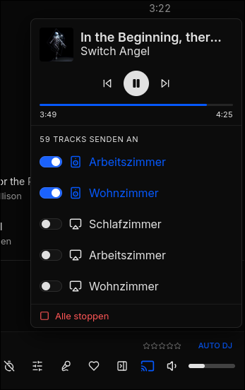
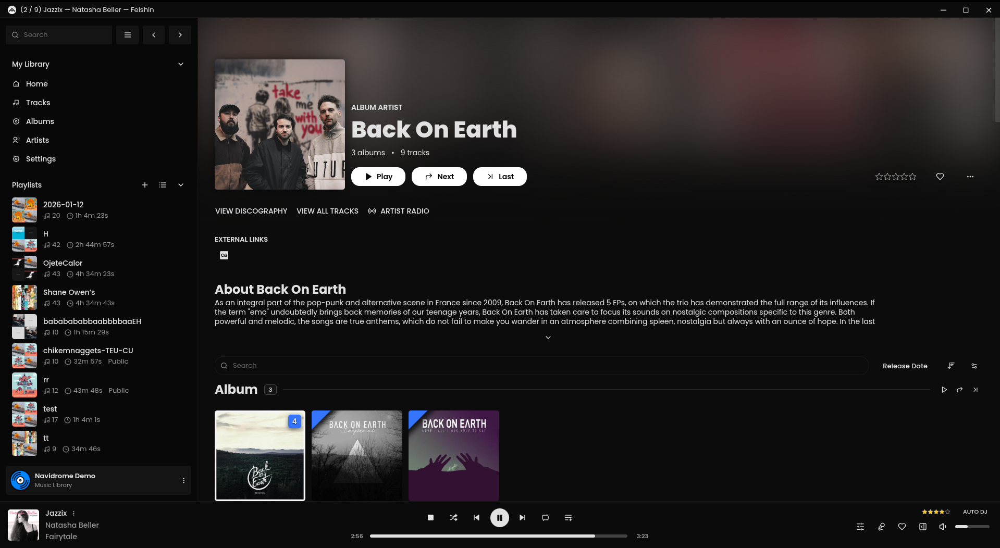
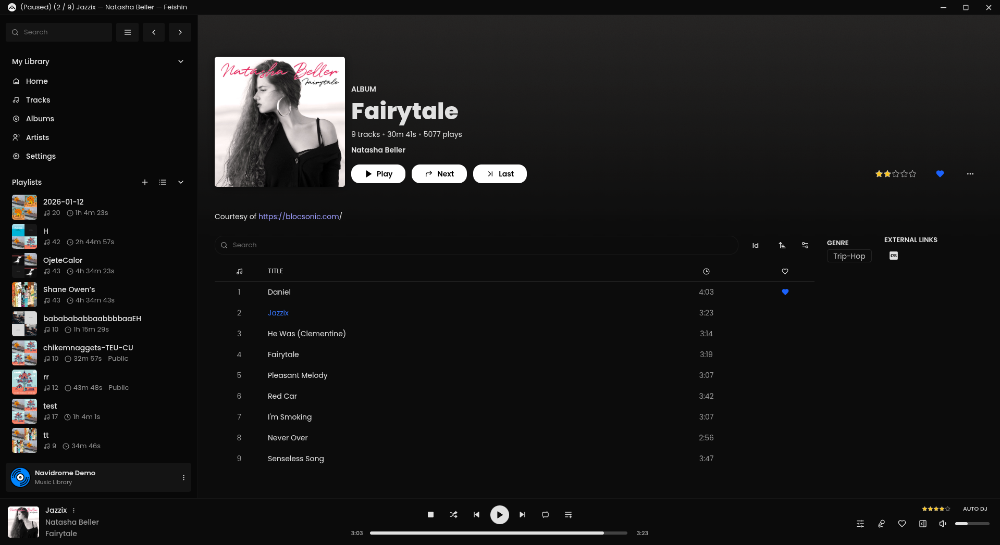
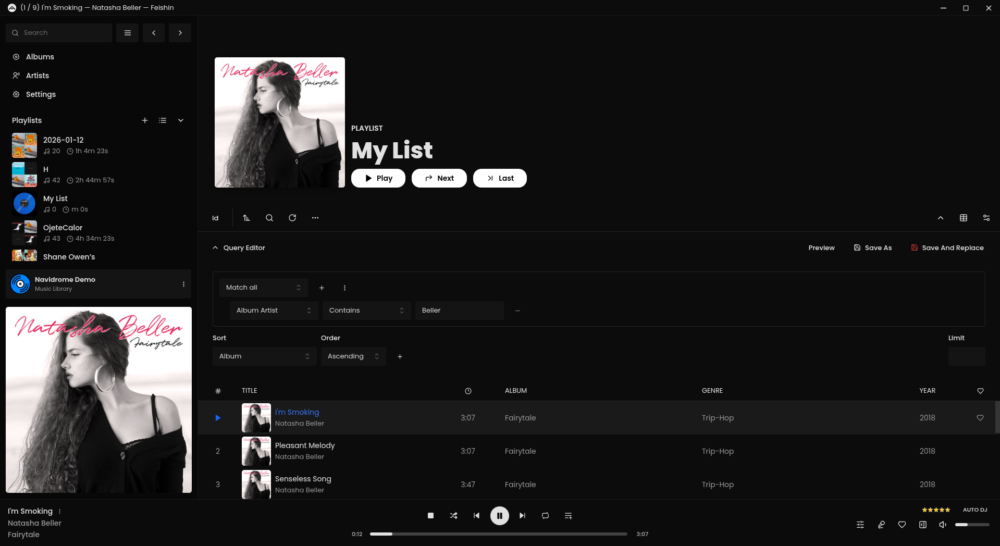

# Feishin — Connect Fork

> **This is a fork of [jeffvli/feishin](https://github.com/jeffvli/feishin).**
> It adds **Feishin Connect** — a Spotify Connect-like feature that streams your Navidrome queue to Sonos speakers and AirPlay devices directly from the player bar.
> All upstream features are preserved.

  <p align="center">
    <a href="https://github.com/jeffvli/feishin/blob/main/LICENSE">
      
    </a>
      <a href="https://github.com/jeffvli/feishin/releases">
      
    </a>
  </p>

---

## Feishin Connect

Feishin Connect adds a cast button to the player bar. Click it to stream the current Navidrome queue — or a radio stream — to any Sonos speaker or AirPlay device on your network, without touching the local player.



## Development Notes

This fork was developed heavily with AI assistance, especially the Connect backend and streaming integration.
Please expect rough edges and report issues if you encounter them.

### How it works

- A **Python / FastAPI** backend runs alongside nginx in the same Docker container.
- It receives Navidrome credentials automatically from Feishin on startup (no manual config).
- Feishin fetches the stream from Navidrome and re-encodes it via **FFmpeg** into a continuous MP3 stream.
- **Sonos** devices are controlled via UPnP (SoCo) and pull the stream over HTTP.
- **AirPlay** devices receive the stream pushed via pyatv / RAOP.

### Features

- Stream the current queue to one or multiple Sonos / AirPlay devices simultaneously
- Sonos multiroom grouping (devices play in sync)
- Per-device volume control with a hover slider
- Play/pause/previous/next controls in the popover (operated on the remote device)
- Radio stream support (sends the live URL directly to the device)
- Persistent state — Connect continues if you reload Feishin in the browser
- Local playback pauses automatically when handing off to a device

### Docker (recommended)

Host networking is required so the backend can discover Sonos and AirPlay devices via mDNS/SSDP multicast.

```yaml
services:
    feishin:
        container_name: feishin
        image: "ghcr.io/mihaitom/feishin-connect:latest"
        restart: unless-stopped
        # host networking required for Sonos/AirPlay mDNS discovery
        network_mode: host
        environment:
            # Feishin / Navidrome server (pre-configured)
            - SERVER_NAME=navidrome
            - SERVER_TYPE=navidrome
            - SERVER_URL=http://your-navidrome:4533
            - SERVER_LOCK=false
            - ANALYTICS_DISABLED=true
            # Optional: override the Connect API URL seen by the browser
            # Default is /api (proxied through nginx). Change only if needed.
            # - CONNECT_URL=/api
```

| Port | Service |
|------|---------|
| 9180 | Feishin web UI (nginx) |
| 8765 | Connect API (FastAPI, also reachable via `/api/` through nginx) |

### Environment variables

| Variable | Default | Description |
|----------|---------|-------------|
| `CONNECT_URL` | `/api` | URL the browser uses to reach the Connect API. The default routes through nginx; set to `http://host:8765` only if you need direct access. |
| `SERVER_URL` | — | Navidrome / Jellyfin server URL |
| `SERVER_NAME` | — | Pre-configured server name shown in Feishin |
| `SERVER_TYPE` | — | `navidrome`, `jellyfin`, or `subsonic` |
| `SERVER_LOCK` | `false` | When `true`, only username/password can be changed |

### Requirements

- Navidrome (or compatible Subsonic/OpenSubsonic server)
- Sonos and/or AirPlay devices on the same network as the Docker host
- Docker host on Linux (host networking is Linux-only; Mac/Windows users need to run the backend natively)

### Electron (desktop app)

Connect also works in the Electron desktop build — the backend runs locally alongside the app.

**Start the backend** (once, before or after launching Feishin):

```bash
cd connect
uv sync          # first time only
uv run python main.py
```

Then launch Feishin normally (`npm run dev` in dev mode, or via the packaged app). The cast button appears in the player bar and connects to `http://localhost:8765` automatically.

When you quit the Electron app, it sends a stop command to the backend so all connected devices stop playing.

### Building locally (Docker image)

```bash
./build.sh <registry> <namespace> <image-name>
# example:
./build.sh ghcr.io myuser feishin-connect
```

Or for web development:

```bash
# Frontend
npm install
npm run dev:web

# Backend (separate terminal)
cd connect
uv sync
uv run python main.py
```

---

## Upstream: Feishin

Rewrite of [Sonixd](https://github.com/jeffvli/sonixd). Original project by [@jeffvli](https://github.com/jeffvli).

### Features

- [x] MPV player backend
- [x] Web player backend
- [x] Modern UI
- [x] Scrobble playback to your server
- [x] Smart playlist editor (Navidrome)
- [x] Synchronized and unsynchronized lyrics support
- [x] **Stream to Sonos / AirPlay via Feishin Connect** *(this fork)*
- [ ] [Request a feature](https://github.com/jeffvli/feishin/issues) or [view taskboard](https://github.com/users/jeffvli/projects/5/views/1)

### Screenshots

<a href="./media/preview_full_screen_player.png"></a> <a href="./media/preview_album_artist_detail.png"></a> <a href="./media/preview_album_detail.png"></a> <a href="./media/preview_smart_playlist.png"></a>

### Getting Started

#### Desktop (recommended)

Download the [latest desktop client](https://github.com/jeffvli/feishin/releases) from the upstream project. The desktop client supports both the MPV and web player backends and includes built-in lyrics fetching.

> **Note:** Feishin Connect is only available in the Docker / web build of this fork, not in the upstream desktop client.

#### macOS Notes

If you're using a device running macOS 12 (Monterey) or higher, [check here](https://github.com/jeffvli/feishin/issues/104#issuecomment-1553914730) for instructions on how to remove the app from quarantine.

For media keys to work, you will be prompted to allow Feishin to be a Trusted Accessibility Client. After allowing, you will need to restart Feishin for the privacy settings to take effect.

#### Linux Notes

Feishin is available in [Flathub](https://flathub.org/en/apps/org.jeffvli.feishin).

Alternatively, install it as an AppImage:

```sh
dir=/your/application/directory
curl 'https://raw.githubusercontent.com/jeffvli/feishin/refs/heads/development/install-feishin-appimage' | sh -s -- "$dir"
```

### Configuration

1. Upon startup you will be greeted with a prompt to select the path to your MPV binary. If you do not have MPV installed, you can download it [here](https://mpv.io/installation/). After inputting the path, restart the app.

2. After restarting, select a server via `Open menu → Manage servers → Add server`. Enter the full URL including protocol and port (e.g. `https://navidrome.my-server.com`).

- **Navidrome** — For the best experience, select "Save password" when creating the server and configure `SessionTimeout` to a larger value (e.g. `72h`) in your Navidrome config.

3. _Optional_ — Host on a subpath by setting `PUBLIC_PATH=/your-path`.

4. _Optional_ — Pre-configure the server via `SERVER_NAME`, `SERVER_TYPE`, `SERVER_URL`, and `SERVER_LOCK=true`.

5. _Optional_ — Set `REMOTE_URL` if your server uses a separate public-facing URL.

6. _Optional_ — Disable analytics with `ANALYTICS_DISABLED=true`.

7. _Optional_ — Override app defaults with `FS_`-prefixed environment variables on first run. See [the settings environment variable documentation](docs/ENV_SETTINGS.md).

## Differences from upstream

| Feature | This fork | Upstream |
|---------|-----------|----------|
| Feishin Connect (Sonos / AirPlay) | ✅ | ❌ |
| Auto-updater | ❌ disabled | ✅ GitHub Releases |
| Docker image | `ghcr.io/mihaitom/feishin-connect` | `ghcr.io/jeffvli/feishin` |

The auto-updater is disabled in this fork. It would otherwise pull releases from `jeffvli/feishin` and overwrite the Connect feature. Update by pulling the latest image (`docker pull`) or rebuilding from source.

---

## FAQ

### MPV is either not working or is rapidly switching between pause/play states

Check that your MPV binary path is correct in Settings. Known working versions: `v0.35.x` and `v0.36.x`. `v0.34.x` is broken.

### What music servers does Feishin support?

Feishin supports any music server implementing [Navidrome](https://www.navidrome.org/), [Jellyfin](https://jellyfin.org/), or an [OpenSubsonic compatible](https://opensubsonic.netlify.app/) API.

- [Navidrome](https://github.com/navidrome/navidrome)
- [Jellyfin](https://github.com/jellyfin/jellyfin)
- OpenSubsonic compatible: Airsonic-Advanced, Ampache, Astiga, Funkwhale, Gonic, LMS, Nextcloud Music, Supysonic, Qm-Music, and more

### Feishin Connect: no devices found

Ensure the container is running with `network_mode: host`. Without host networking, mDNS/SSDP multicast packets cannot reach the container and no devices will be discovered.

### Feishin Connect: nothing plays (device found but no audio)

Check the container logs for `❌ ffmpeg NICHT GEFUNDEN`. FFmpeg is required for audio transcoding and is included in the Docker image. If you're running the backend natively, install FFmpeg via your package manager.

### I have the issue "The SUID sandbox helper binary was found, but is not configured correctly" on Linux

Enable unprivileged namespaces or set the `chrome-sandbox` binary to Setuid:

```bash
chmod 4755 chrome-sandbox
sudo chown root:root chrome-sandbox
```

## Development

Built and tested using Node `v23.11.0`. This project is built off of [electron-vite](https://github.com/alex8088/electron-vite).

- `npm run dev` — Start the development server
- `npm run build:web` — Build the standalone web app
- `npm run typecheck` — Type check the project
- `npm run lint` — Lint the project

## Translation

This project uses [Weblate](https://hosted.weblate.org/projects/feishin/) for translations. Contributions welcome.

## License

[GNU General Public License v3.0 ©](https://github.com/jeffvli/feishin/blob/dev/LICENSE)
